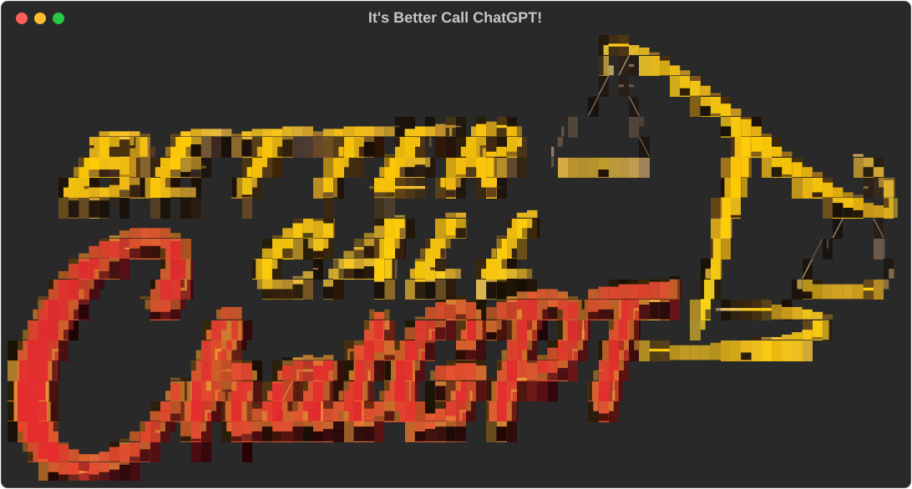

<div align="center">



# ⚖ BetterCallChatGPT ⚖

**A [Claude Code](https://claude.com/claude-code) skill that gets OpenAI's Codex CLI
(`codex`, ChatGPT) to _criticize_ your codebase — then Claude triages the feedback and
implements it. `codex` only reviews and proposes: under its native read-only sandbox it can
inspect your repo but never edits your code or runs the fixes it proposes — Claude does that.**

[](LICENSE)

**🔗 Sibling skill: [⚖ BetterCallGemini ⚖](https://github.com/douglasadamoski/BetterCallGemini) — the same idea, with Google's Gemini (`agy`) instead of ChatGPT.**

</div>

---

## 🚀 Let's get the job done

Three steps and you're reviewing code with ChatGPT from inside Claude Code.

### 1️⃣ Put `codex` to work
Install **[Codex CLI](https://developers.openai.com/codex/cli/)** and make sure `codex` is on
your `PATH`. Log in once and confirm it answers:

```bash
codex login                 # complete the ChatGPT sign-in in your browser
                            #   (headless / over SSH? run instead:  codex login --device-auth )
codex login status          # should print "Logged in using ChatGPT"
codex exec -s read-only --skip-git-repo-check "reply with OK"   # a quick smoke test
```

### 2️⃣ Put this skill in your Claude
Easiest — install it as a **plugin** from its built-in marketplace, right inside Claude Code:

```
/plugin marketplace add douglasadamoski/BetterCallChatGPT
/plugin install better-call-chatgpt@bettercallchatgpt
```

Prefer a plain clone instead? The repo root *is* the skill, so:

```bash
git clone https://github.com/douglasadamoski/BetterCallChatGPT.git ~/.claude/skills/BetterCallChatGPT
```

(See [Install](#install) for all three methods.)

### 3️⃣ That's it — call it
In Claude Code, run the slash command:

```
/BetterCallChatGPT
```

…or just describe the task and let Claude auto-trigger it:

```
better call chatgpt on this folder
```

Either way, Claude composes the critique prompt, points Codex at your codebase, brings back a
prioritized review, and implements the findings worth keeping — while Codex's **native
read-only sandbox** makes sure it never changed a thing. ✅

---

## Why

Claude is great at writing and changing code, but a second, *independent* model is a powerful
critic. BetterCallChatGPT hands a whole codebase to ChatGPT via `codex`, asks for a broad,
intent-first critique (no test suite spoon-fed — Codex invents the tests it would write), and
brings back a prioritized findings report. **Claude** then decides what's valid and implements it.

Unlike its sibling **[BetterCallGemini](https://github.com/douglasadamoski/BetterCallGemini)** —
where `agy` couldn't be sandboxed headlessly, so an external *edit-guard* had to restore any file
it touched — **Codex has a native read-only sandbox**. So "ChatGPT doesn't touch your code" is
guaranteed by Codex itself, with **no edit-guard and no PTY hacks**:

- Every call runs `codex -a never -c sandbox_mode="read-only" -c approval_policy="never" …`,
  which blocks the model's file writes, `apply_patch`, new files, and `git` mutations, and stops
  it pausing for approval (which would hang a non-interactive run).
- **Claude is the sole executor** — in experiment mode Codex *proposes* scripts as text; Claude
  reviews each one and runs only the approved ones.
- Codex is **never** run with `--dangerously-bypass-approvals-and-sandbox`.

See [`references/codex_notes.md`](references/codex_notes.md) for the full, verified integration notes.

## Two modes

| Mode | What happens |
|------|--------------|
| **A — Critique** (default) | `codex` reads the scope and returns a written, prioritized critique. Claude triages each finding (accept/reject/investigate) and implements the good ones. No conda needed. |
| **B — Experiment** | `codex` *designs* experiments/tests and **proposes** scripts as text (it can't write them under read-only). Claude writes them into a sandbox dir, reviews each, runs the approved ones in a conda env, and feeds results back. |

## Requirements

- **[Claude Code](https://claude.com/claude-code)** — this is a skill it loads.
- **`codex`** (Codex CLI) — on your `PATH` and logged in (`codex login`, or `codex login
  --device-auth` on a headless box). Default model `gpt-5.5`.
- **bash 4+**, coreutils (`flock`, `readlink -f`, `timeout`), and **python3** (for parsing
  Codex's `--json` stream — Pillow only if you regenerate the banner).
- **conda** — only for Mode B (running proposed scripts). Configurable env via `--env` /
  `$BCC_CONDA_ENV` (default `base`). Mode A needs no conda.
- **chafa** — optional, only if you want to regenerate the banner with it (a dependency-free
  Python renderer is bundled).

## Install

Pick whichever you like — all three end up with the skill available as `/BetterCallChatGPT`.
No build step in any of them.

### Method 1 — Plugin marketplace (recommended)
This repo is also a Claude Code plugin marketplace, so you can install it without leaving Claude:

```
/plugin marketplace add douglasadamoski/BetterCallChatGPT
/plugin install better-call-chatgpt@bettercallchatgpt
```

Update later with `/plugin marketplace update bettercallchatgpt`.

### Method 2 — Clone into your skills folder
Claude Code auto-discovers skills under `~/.claude/skills/`. The repo root *is* the skill, so
clone it directly as the skill folder:

```bash
git clone https://github.com/douglasadamoski/BetterCallChatGPT.git ~/.claude/skills/BetterCallChatGPT
```

### Method 3 — Let Claude clone it for you
In any Claude Code session, just ask:

> clone `https://github.com/douglasadamoski/BetterCallChatGPT` into `~/.claude/skills/BetterCallChatGPT`

### Then use it
```
/BetterCallChatGPT
```
…or just say *"better call chatgpt on this folder"* / *"have codex criticize this code"*.

## Usage

Once installed, you drive it through Claude Code in natural language — Claude composes the
intent description, runs the wrapper, and triages the results for you. Under the hood it calls:

```bash
# Mode A — critique
scripts/codex_review.sh \
  --prompt-file <prompt.md> \
  --out PROJECT/BETTERCALLCHATGPT_REVIEW_<ts>.md \
  --scope <dir> \
  --model gpt-5.5 --effort high
```

The script's last stdout line is `RESULT=<OK|AUTH|CAP|QUOTA|TIMEOUT|ERROR>` so Claude can branch
(e.g. **stop and wait** on quota rather than hammering the API).

### Quota

There is no programmatic quota readout for `codex`, so the skill tracks usage: a daily **call
cap** (`--cap`, default 99999 — effectively unlimited) and an append-only ledger at `state/usage.jsonl` that logs **real
token counts** from Codex's `--json` stream. On a rate-limit / quota / credits error, it
**stops and tells you to wait** for the reset. Higher `--effort` (`xhigh`) burns rate limits
faster.

## Layout

```
SKILL.md                 # how Claude orchestrates the skill (the "brain")
scripts/
  codex_review.sh        # entrypoint: one codex exec turn (critique or experiment) + ledger
  _codex_common.sh       # shared lib: read-only runner, quota/token ledger, error classification
  codex_extract.py       # parse codex --json → critique text + token usage + session id
  run_local.sh           # Claude runs an approved script, confined to the sandbox dir
  show_header.sh          # the colored banner header
  img2ansi.py             # regenerate the banner art from the poster PNG (no chafa needed)
  blacken_to_transparent.py  # drop a chafa capture's black bg to the terminal background
  make_banner_svg.py      # render the ANSI art into the README's terminal-window SVG (needs rich)
templates/
  critique_prompt.md     # Mode A prompt template
  experiment_prompt.md   # Mode B prompt template
references/
  codex_notes.md         # verified codex knowledge: flags, sandbox, error strings, JSON shapes
assets/                  # banner art + source poster
state/                   # runtime ledger + last session id + temp prompts (gitignored)
```

## Configuration

| Knob | Where | Default |
|------|-------|---------|
| Model | `--model` | `gpt-5.5` |
| Reasoning effort | `--effort` (`low`/`medium`/`high`/`xhigh`) | `high` |
| Daily call cap | `--cap` | `99999` (effectively unlimited) |
| Sandbox conda env | `--env` / `$BCC_CONDA_ENV` | `base` |
| Wrapper timeout | `$BCC_TIMEOUT` | `20m` |
| Skip session persistence | `$BCC_EPHEMERAL=1` | off (sessions kept for `--continue`) |

## Safety notes

- `run_local.sh` is **not** a security jail — it only verifies the script lives under the
  sandbox dir and runs it with your normal privileges. **The Claude review gate is the real
  boundary**: never run an unreviewed Codex-proposed script.
- Read-only is enforced by Codex's own sandbox; the wrapper always passes `-a never
  -c sandbox_mode="read-only" -c approval_policy="never"`. A *nested* codex run inside the
  sandbox fails by design (`os error 30`) — the skill never nests. See
  [`references/codex_notes.md`](references/codex_notes.md).

## License

[GPL-3.0](LICENSE) © 2026 Douglas Adamoski.
